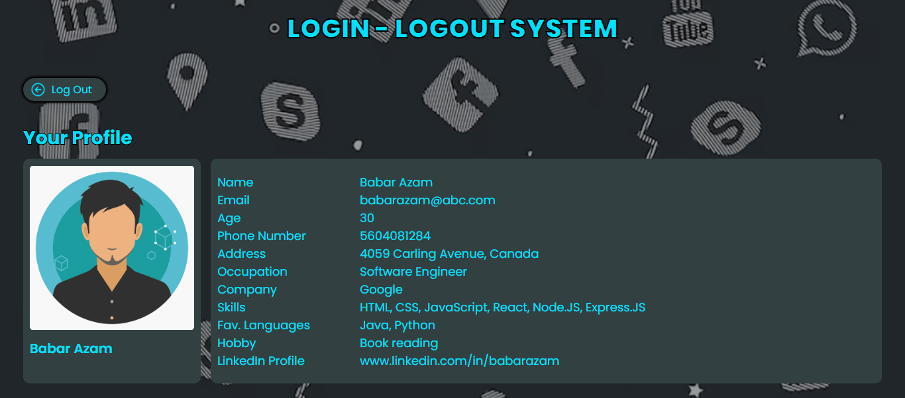

# Login Logout System
## 🚀 Overview
This project is a complete Login and Logout Authentication System built using Node.js, Express, MongoDB, and EJS. It allows users to create an account, securely log in, and log out of their session. The system is powered by JWT-based authentication, with passwords securely hashed using bcrypt and session handling via cookie-parser.

 

## 🚀 Screenshots

 

## 🚀 Features
- **User Registration** – Create a new account with secure password hashing using bcrypt
- **User Login** – Authenticate with credentials and receive a secure JWT token
- **User Logout** – Securely log out by clearing authentication cookies
- **Protected Routes** – Access to certain routes only when authenticated
- **Cookie Handling** – Session management using cookie-parser

 

## 🚀 Tech Stack
- **Frontend:** EJS, CSS
- **Backend:** Node.js, Express.js
- **Database:** MongoDB, Mongoose
- **Authentication:** bcrypt, jsonwebtoken